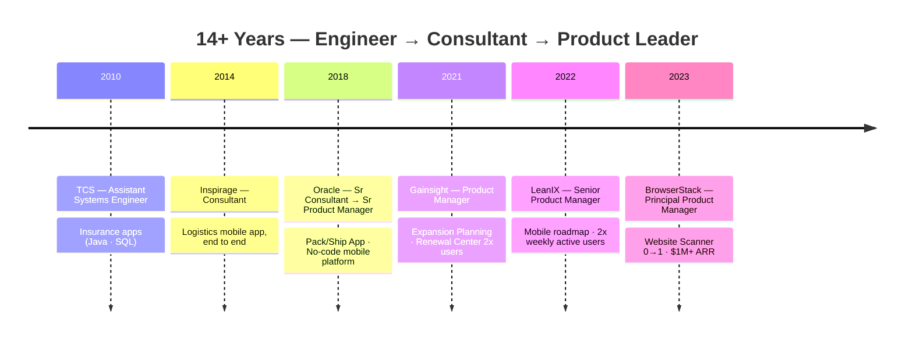
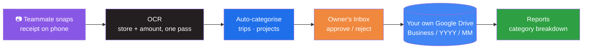
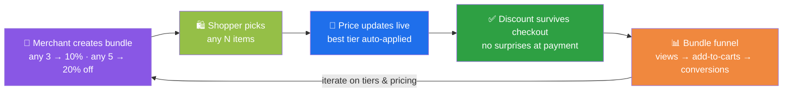

<div align="center">

[](https://git.io/typing-svg)

[](https://linkedin.com/in/vivekvardhanreddy/)
[]()
[]()

</div>

---

## About Me

**Principal Product Manager with 14+ years in B2B SaaS**, specializing in **0→1 product development** and **platform scaling**. I've led products generating **$1M+ ARR** and acquired **8,000+ users** at BrowserStack, with a career spanning Oracle, Gainsight, LeanIX, and BrowserStack.

What makes me different: **I build what I spec.** Outside work I ship real products end to end — **[Starlog](https://starlogapp.com/)**, a receipt scanner & expense app for small businesses; a Shopify commerce app with checkout-safe discount logic; native macOS/iOS apps. My product judgment is grounded in engineering reality, not just frameworks.

<table>
<tr>
<td width="50%">

```yaml
Role        : Principal Product Manager @ BrowserStack
Experience  : 14+ years — TCS → Oracle → Gainsight
              → LeanIX → BrowserStack
Specialty   : 0→1 products · platform scaling
              · monetisation · growth
Education   : IIM Mumbai (MBA) · KIIT (B.Tech CSE)
Base        : Hyderabad, India
Edge        : A PM who ships — my own app, Starlog,
              is live on the App Store & Google Play
Toolkit     : Product Strategy · User Research
              · A/B Testing · GTM · SQL · Claude Code
```

</td>
<td width="50%">

**Key Achievements:**
- 🔍 **[Website Scanner](https://www.browserstack.com/website-scanner)** *(BrowserStack)* — led 0→1 launch; **8,000+ beta users**, validated product-market fit in web testing
- 💰 **$1M+ incremental ARR** *(BrowserStack)* — redesigned website, docs & support platform; scaled discoverability from **4 → 20 products**
- 📈 **Expansion Planning** *(Gainsight)* — ideation to launch in **< 6 months**; enabled revenue expansion for CS teams
- 📦 **Pack/Ship App** *(Oracle)* — built in 6 months; optimized multi-level warehouse packing & shipping costs

</td>
</tr>
</table>

---

## 💼 Professional Experience



| Company | Role | Tenure | Impact |
|---------|------|--------|--------|
| **BrowserStack** | Principal Product Manager | Mar 2023 – Present | 0→1 launch of **[Website Scanner](https://www.browserstack.com/website-scanner)** (8,000+ beta users, PMF validated) · **$1M+ incremental ARR** via website/docs/support redesign · scaled discoverability 4→20 products · ICP definition & go/no-go for low-code/no-code testing market |
| **LeanIX** | Senior Product Manager | Aug 2022 – Mar 2023 | Defined mobile product roadmap · **+100% weekly active users** by removing adoption blockers |
| **Gainsight** | Product Manager | Jan 2021 – Jul 2022 | Launched **Expansion Planning** from ideation in <6 months · **2× unique users** for Renewal Center in 6 months · improved Net Dollar Retention for CS teams |
| **Oracle** | Senior Product Manager | May 2019 – Jan 2021 | Built **Pack/Ship App** ideation→launch in 6 months · no-code mobile platform cut supply-chain app delivery time **50%** · ran 2 products with 2 Scrum teams (18 engineers) across global time zones |
| **Oracle** | Senior Consultant | Feb 2018 – May 2019 | Solution Architect for Oracle Fusion Transportation Management |
| **Inspirage LLC** | Consultant | May 2014 – Feb 2018 | Owned logistics mobile app end-to-end — grew it into a high-impact product |
| **TCS** | Assistant Systems Engineer | Aug 2010 – May 2012 | Insurance applications in Java & SQL |

<div align="center">

🎓 **IIM Mumbai** — PGDIM (MBA), 2014 &nbsp;·&nbsp; **KIIT Bhubaneswar** — B.Tech Computer Science, 2010

</div>

---

## 🛠 I Build What I Spec — Side Projects

> A PM's roadmap is only as good as their grasp of what it takes to build it. These are products I've designed, built, and shipped myself — end to end.

### 📱 Starlog — Receipt Scanner & Expense App *(flagship · live on both stores)*

<div align="center">

[](https://apps.apple.com/app/starlog-receipt-expense-log/id6768408651)
[](https://play.google.com/store/apps/details?id=com.starlancegroup.starlog)
[](https://starlogapp.com/)

[]()
[]()
[]()
[]()

</div>

**Every receipt, accounted for. Automatically.** Snap a receipt — Starlog reads the store and amount in one OCR pass, categorises it, groups spend into trips or projects, and files it to **your own Google Drive** in a clean year/month tree. Teammates capture on their phones (invited with a 6-character code), you approve from an Inbox, and each business you run keeps its own receipts, reports, and Drive folder.



```yaml
Product   : Receipt scanner & expense tracker for small businesses
Live      : App Store + Google Play + starlogapp.com
Position  : Drive-native — receipts land in YOUR Drive; Starlog never holds your data
Teams     : Teammates snap, you approve — free, no per-seat fees
Monetise  : Subscriptions + consumable receipt packs via RevenueCat
Stack     : Flutter — one Dart codebase → iOS + Android
Origin    : Validated as a native Swift prototype (on-device Vision OCR → Drive),
            then productized in Flutter — prototype → PMF signal → product
```

---

### 🛒 Starbundle — Shopify "Mix & Match" Bundles App

<div align="center">

[]()
[]()
[]()
[]()
[]()

</div>

Merchants define Mix & Match bundles with tiered discounts (*any 3 → 10%, any 5 → 20%*); shoppers pick any *N* items and watch the price update live. The discount **carries through checkout intact** — the #1 failure mode of bundle apps — and merchants get a funnel view per bundle to iterate on pricing.



<details>
<summary><b>Key engineering decisions</b></summary>

| Decision | Why it matters |
|----------|----------------|
| **One pricing brain, two runtimes** | Tier evaluation lives in `pricing.ts` (unit-tested); the Cart Transform Function can't import app code, so `pricing.js` is a deliberate, test-guarded mirror |
| **Cart Transform over cart attributes** | The discount is re-derived at checkout from the bundle definition — totals stay correct even if the shopper edits the cart |
| **App Proxy is the only door in** | Storefront widget talks to the app exclusively through HMAC-verified App Proxy routes |
| **Attribution via webhooks** | `orders/create` webhook closes the loop — views → add-to-carts → conversions per bundle |
| **Onboarding that verifies** | Polls live theme settings to confirm the storefront extension is actually enabled before declaring setup complete |

</details>

---

### 🗂 Mac File Organizer — Native macOS App *(shipped)*

[]()
[](https://github.com/vivekreddy/Mac-File-Organizer-Releases)
[]()

A **SwiftUI** app that sorts a folder's files into categorized destinations by type — real-time search, drag & drop, SF Symbol icons per file type. Distributed to users via a [public releases repo](https://github.com/vivekreddy/Mac-File-Organizer-Releases).

---

### 🕉 HinduHub — Community Platform

[]()
[]()
[]()

A **Next.js** platform for Hindu temples, events, and resources — computing **panchang data (tithis, nakshatras) client-side** with `astronomy-engine` instead of relying on a lookup API.

<details>
<summary><b>📦 More projects</b></summary>

| Project | Stack | What it is |
|---------|-------|------------|
| **starlance-website** | TypeScript · Next.js | Studio / product site for Starlance |
| **[starlogapp.com](https://starlogapp.com/)** | TypeScript · Next.js | Product & marketing site for Starlog |
| **[WebLinkScan](https://github.com/vivekreddy/WebLinkScan)** | TypeScript | Crawls a site and reports broken links |
| **[dev-utility-hub](https://github.com/vivekreddy/dev-utility-hub)** | TypeScript | Collection of developer utilities |
| **shopify-currency-converter** | Liquid | Storefront currency conversion for Shopify themes |
| **cultfit-attribution / -renewals** | JavaScript | Marketing attribution & renewals analytics pipelines |

</details>

---

## 🧰 Skills & Stack

<table>
<tr>
<td width="50%" valign="top">

**Product**

`Product Strategy` · `0→1 Development` · `Monetisation` · `User Research` · `A/B Testing` · `Go-to-Market` · `Roadmapping` · `ICP Definition` · `SQL` · `Claude Code`

</td>
<td width="50%" valign="top">

**Domains**

`B2B SaaS` · `Developer Tools` · `Customer Success / Revenue` · `Supply Chain & Logistics` · `Enterprise Architecture` · `Commerce`

</td>
</tr>
</table>

<div align="center">

**Hands-On Technology**

[](https://skillicons.dev)

[](https://skillicons.dev)

</div>

---

## 📊 GitHub Stats

<div align="center">


[](https://github.com/vivekreddy)

<sub>Most of my building happens in private repos — public stats under-count Swift, Dart, and Liquid.</sub>

</div>

---

## Philosophy

> *"The best PMs have built something themselves — you can't prioritize what you don't understand."*

| Principle | Practice |
|-----------|----------|
| **0→1 with evidence** | Website Scanner: validate PMF with 8,000+ beta users before scaling |
| **Monetisation is product work** | Pricing tiers, subscriptions, consumables — designed AND implemented |
| **Ship to learn** | Every side project targets a store or release channel, not a demo folder |
| **Data over opinion** | A/B testing, SQL, ICP definition, go/no-go decisions backed by research |
| **Technical empathy** | I build with the same tools my engineers use — including Claude Code |

---

<div align="center">

**Let's build products people love.**

[](https://linkedin.com/in/vivekvardhanreddy/)


</div>
