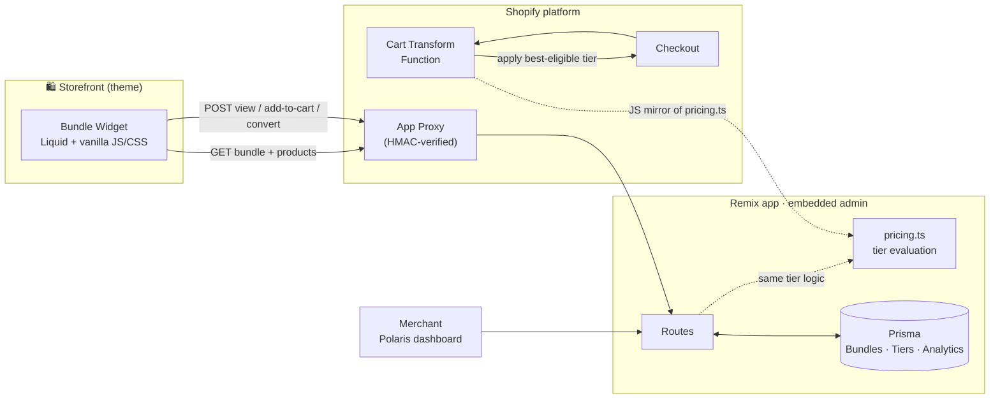
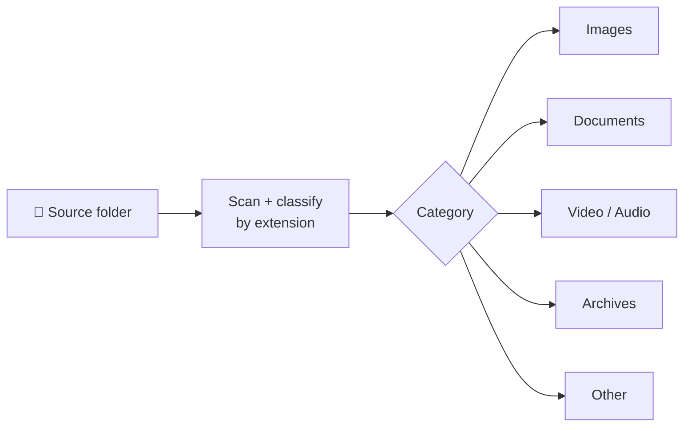
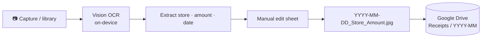

<h1 align="center">Hi, I'm Vivek 👋</h1>

  <b>Founder &amp; full-stack engineer.</b> I build and ship products end to end —
   commerce apps, cross-platform mobile, native macOS/iOS, and polished web front ends.

  📍 Bengaluru, India &nbsp;·&nbsp; 🛠 Building under <a href="https://github.com/starlance"><b>@starlance</b></a> &nbsp;·&nbsp; ⚡ Currently shipping <b>Starlog</b>

  
  
  
  

---

## 🎯 What I do

I take products from a blank repo to something people actually use. In practice that means jumping across the stack in a single project — a **Shopify Cart Transform Function** one day, a **SwiftUI** view or a **Flutter** paywall the next, and a **Next.js** front end after that. Most of my work is private client and product code, so the sections below are **architectural write-ups** rather than open source — the "how it's built," with diagrams, since the source isn't public.

## 🖥 Interactive résumé — live demo

To make this profile more than a static page, I rebuilt GitHub's own profile **Overview** as a pixel-faithful clone and deployed it. It's a genuine front-end exercise (**Next.js 16 · React 19 · Tailwind v4 · TypeScript**), with a deterministically-seeded contribution heatmap that renders identically on server and client.

  
   
  <b><a href="https://vivek-portfolio-vivekreddy.netlify.app">▶ vivek-portfolio-vivekreddy.netlify.app</a></b> — click to interact

---

## 🚀 Featured work

> Deep-dives are collapsed to keep this scannable. Expand any project for the full architecture.

### 🛒 Starbundle — Shopify "Mix &amp; Match" bundles app

A Shopify app that lets merchants build **Mix &amp; Match** bundles with **tiered discounts**. Shoppers pick any *N* items from configured collections; the storefront widget calculates the discount live, and — critically — the discount **survives checkout** via a Cart Transform Function instead of fragile cart attributes.

`Remix 2.16 (Vite)` · `Polaris 12 + App Bridge` · `Prisma + SQLite/Postgres` · `Cart Transform Function` · `Theme app extension` · `Vitest`

<b>Architecture notes</b>

- **One source of truth for pricing, mirrored across two runtimes.** Tier evaluation (`any 3 → 10%`, `any 5 → 20%`, highest-eligible wins) lives in `app/lib/pricing.ts`, unit-tested with Vitest. The Cart Transform Function can't import app code, so `pricing.js` is a deliberate mirror — the tests guard both.
- **Discounts persist without cart hacks.** Rather than writing cart attributes and hoping they survive, the **Cart Transform Function** re-derives the discount at checkout from the bundle definition, so totals are correct even if the shopper edits the cart.
- **App Proxy is the storefront's only door in.** The widget talks to `proxy.bundle.tsx` (definition + products) and `proxy.events.tsx` (analytics) through Shopify's App Proxy, with HMAC verification in `proxyAuth.server.ts`.
- **Attribution via webhooks.** `webhooks.orders.create.tsx` closes the loop — views → add-to-carts → conversions are counted per bundle for the analytics dashboard.
- **Onboarding that actually verifies.** The onboarding route polls live theme settings (`api.onboarding-check.tsx`) to confirm the storefront extension is enabled before declaring setup complete.

---

### 📱 Starlog — cross-platform mobile app *(in active development)*

The product I'm currently building. A **Flutter** app targeting **iOS and Android** from one codebase, monetized with subscriptions **and** consumable packs.

`Flutter / Dart` · `RevenueCat (purchases_flutter)` · `iOS + Android`

<b>Architecture notes</b>

- **Monetization via RevenueCat.** Subscriptions and consumable receipt packs are delivered through `purchases_flutter`, configured at boot with platform SDK keys.
- **No secrets in git.** Keys are injected with `--dart-define-from-file` from a gitignored `dart_defines.json`; `scripts/run.sh` and the VS Code launch configs wire it up so local runs and CI stay clean.
- **One codebase, two stores.** Shared Dart UI and business logic ship to both App Store and Play Store.

---

### 🗂 Mac File Organizer — native macOS app *(shipped)*

A **SwiftUI** macOS app that sorts a folder's files into categorized destinations by type, with a polished dark UI. Distributed to users via a public [releases repo](https://github.com/vivekreddy/Mac-File-Organizer-Releases).

`SwiftUI` · `macOS 14+` · `SF Symbols` · `Drag &amp; drop`

<b>Highlights</b>

- **Real product, not a toy.** Ships as a distributable macOS build with a dedicated public releases channel.
- **SwiftUI-native UX** — real-time search, drag &amp; drop, quick-access sidebar, spring animations, translucent materials, and automatic SF Symbol icons per file type.

---

### 🧾 ReceiptScanner — iOS expense capture

An **iOS** app that photographs receipts, reads them with **on-device OCR**, and files them into Google Drive organized by month — no data leaves the phone until you upload.

`SwiftUI` · `Vision (on-device OCR)` · `Google Drive API` · `GoogleSignIn`

<b>Highlights</b>

- **On-device OCR first.** Apple's Vision framework auto-detects store name, amount, and date locally; the user can correct any field before upload.
- **Deterministic filing.** Every receipt lands as `YYYY-MM-DD_Store_Amount.jpg` under a `Receipts / YYYY-MM` folder tree in Drive, with live upload progress.

---

### 🕉 HinduHub &amp; web work

A **Next.js** community platform for Hindu temples, events, and resources — notably using **`astronomy-engine`** to compute panchang/astronomical data (tithis, nakshatras) client-side. Part of a broader stream of Next.js / Astro / TypeScript sites I build for products and clients.

`Next.js` · `React` · `TypeScript` · `astronomy-engine` · `date-fns`

---

<h3>📦 More projects</h3>

| Project | What it is | Stack |
| --- | --- | --- |
| **starlance-website** | Studio / product site for Starlance | TypeScript · Next.js |
| **starlog-website** | Marketing site for the Starlog app | TypeScript · Next.js |
| **cultfit-attribution / -renewals** | Marketing attribution &amp; renewals analytics | JavaScript |
| **shopify-currency-converter** | Storefront currency conversion | Liquid |
| **WebLinkScan** | Broken-link / web link scanner | TypeScript |
| **dev-utility-hub** | Collection of developer utilities | TypeScript |
| **Expense-Manager-iOS** | See *ReceiptScanner* above | Swift |

---

## 🧰 Toolbox

**Languages**
 

**Web &amp; mobile**
 

**Platform &amp; tooling**
 

---

## 📊 GitHub

  
  

Language totals reflect public repos; most of my work is private, so this under-counts Swift, Dart, and Liquid.

---

  <b>Let's build something.</b>
   
  <a href="https://vivek-portfolio-vivekreddy.netlify.app">Portfolio</a> ·
  <a href="https://linkedin.com/in/vivekreddy">LinkedIn</a> ·
  <a href="https://x.com/vivekreddy">X</a> ·
  <a href="mailto:starlancegrp@gmail.com">starlancegrp@gmail.com</a>

