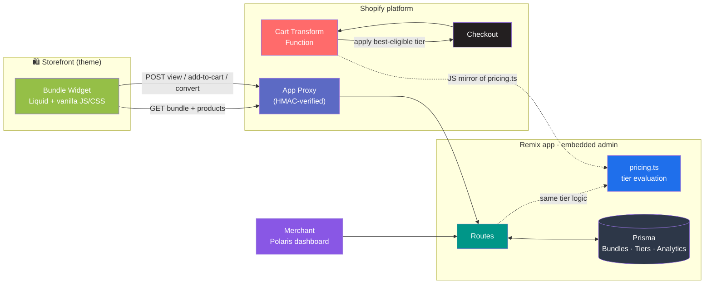
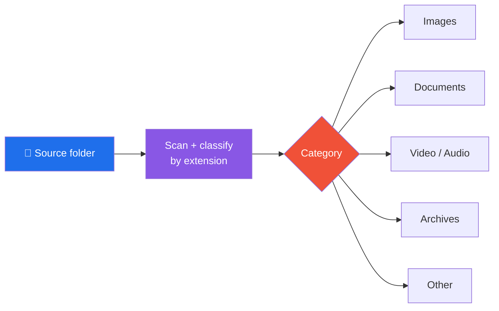
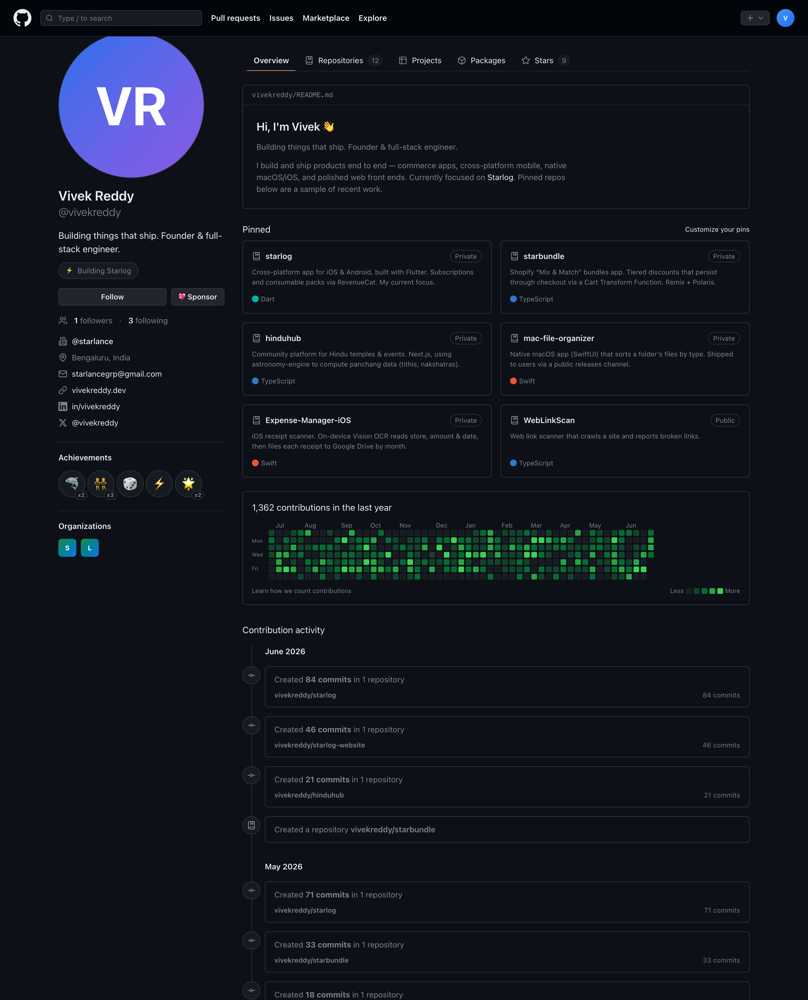
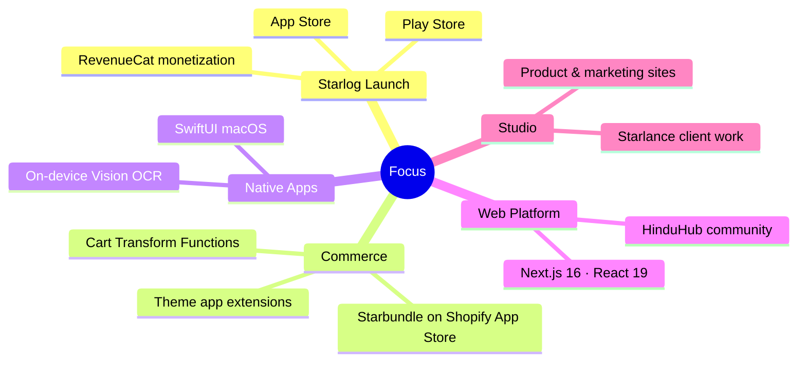

<div align="center">

[](https://git.io/typing-svg)

[](https://linkedin.com/in/vivekreddy)
[](https://github.com/starlance)
[]()

</div>

---

## About Me

I'm a **founder and full-stack engineer** who takes products from a blank repo to something people actually use. In practice that means jumping across the stack in a single project — a **Shopify Cart Transform Function** one day, a **SwiftUI** view or a **Flutter** paywall the next, and a **Next.js** front end after that. Most of my work is private client and product code, so this page is built from **architectural write-ups** — the "how it's built," with diagrams — rather than open source.

<table>
<tr>
<td width="50%">

```yaml
Current Focus  : Starlog — Flutter app (iOS + Android)
Shipped        : Mac File Organizer (native macOS)
               : ReceiptScanner (iOS, on-device OCR)
In Flight      : Starbundle (Shopify commerce app)
               : HinduHub (Next.js community platform)
Languages      : TypeScript · Swift · Dart · JavaScript
Platforms      : Web · iOS · Android · macOS · Shopify
Base           : Bengaluru, India — under @starlance
Mode           : Solo founder — design → build → ship
```

</td>
<td width="50%">

**Currently Building:**
- 📱 **Starlog** — cross-platform Flutter app, subscriptions & consumable packs via RevenueCat
- 🛒 **Starbundle** — Shopify Mix & Match bundles with checkout-safe tiered discounts
- 🕉 **HinduHub** — temple & events platform computing panchang data client-side
- 🌐 Product & marketing sites for the **Starlance** studio

</td>
</tr>
</table>

---

## 🛒 Flagship Project — Starbundle

**Shopify "Mix & Match" bundles app.** Merchants define bundles with tiered discounts (*any 3 → 10%, any 5 → 20%*); shoppers pick any *N* items from configured collections; the storefront widget calculates the discount live — and, critically, the discount **survives checkout** via a Cart Transform Function instead of fragile cart attributes.

<div align="center">

[]()
[]()
[]()
[]()
[]()
[]()

</div>



<details>
<summary><b>Key engineering decisions</b></summary>

| Decision | Why it matters |
|----------|----------------|
| **One pricing brain, two runtimes** | Tier evaluation lives in `pricing.ts` (unit-tested); the Cart Transform Function can't import app code, so `pricing.js` is a deliberate, test-guarded mirror |
| **Cart Transform over cart attributes** | The discount is re-derived at checkout from the bundle definition — totals stay correct even if the shopper edits the cart |
| **App Proxy is the only door in** | Storefront widget talks to the app exclusively through HMAC-verified App Proxy routes |
| **Attribution via webhooks** | `orders/create` webhook closes the loop — views → add-to-carts → conversions per bundle |
| **Onboarding that verifies** | Polls live theme settings to confirm the storefront extension is actually enabled before declaring setup complete |

</details>

---

## 🚀 Products

### 📱 Starlog — Cross-Platform Mobile App *(current focus)*

<div align="center">

[]()
[]()
[]()

</div>

```yaml
What      : The product I'm currently building — one Dart codebase, two stores
Monetize  : Subscriptions AND consumable packs via purchases_flutter
Secrets   : --dart-define-from-file from a gitignored dart_defines.json —
            keys never touch git, local runs and CI stay clean
Ecosystem : Companion marketing site (Next.js) built alongside the app
```

---

### 🗂 Mac File Organizer — Native macOS App *(shipped)*

<div align="center">

[]()
[](https://github.com/vivekreddy/Mac-File-Organizer-Releases)
[]()

</div>

A **SwiftUI** macOS app that sorts a folder's files into categorized destinations by type — real-time search, drag & drop, spring animations, translucent materials, SF Symbol icons per file type. Distributed to users via a [public releases repo](https://github.com/vivekreddy/Mac-File-Organizer-Releases).



---

### 🧾 ReceiptScanner — iOS Expense Capture *(shipped)*

<div align="center">

[]()
[]()
[]()

</div>

Photograph a receipt → **on-device Vision OCR** extracts store, amount & date → manual-correct sheet → files to Google Drive as `YYYY-MM-DD_Store_Amount.jpg` under `Receipts / YYYY-MM`. No data leaves the phone until upload.


---

### 🕉 HinduHub — Community Platform

<div align="center">

[]()
[]()
[]()

</div>

A **Next.js** platform for Hindu temples, events, and resources — notably computing **panchang data (tithis, nakshatras) client-side** with `astronomy-engine` instead of relying on a lookup API.

---

### 🖥 This Profile, Rebuilt as an App

I rebuilt GitHub's own profile **Overview** as a pixel-faithful clone — **Next.js 16 · React 19 · Tailwind v4 · TypeScript**, with a deterministically-seeded contribution heatmap that renders identically on server and client (no hydration mismatch).

<p align="center">
  
</p>

---

## 📦 More Projects

| Project | Stack | What it is |
|---------|-------|------------|
| **starlance-website** | TypeScript · Next.js | Studio / product site for Starlance |
| **starlog-website** | TypeScript · Next.js | Marketing site for the Starlog app |
| **[WebLinkScan](https://github.com/vivekreddy/WebLinkScan)** | TypeScript | Crawls a site and reports broken links |
| **[dev-utility-hub](https://github.com/vivekreddy/dev-utility-hub)** | TypeScript | Collection of developer utilities |
| **shopify-currency-converter** | Liquid | Storefront currency conversion for Shopify themes |
| **cultfit-attribution / -renewals** | JavaScript | Marketing attribution & renewals analytics pipelines |

---

## 🧰 Tech Stack

<div align="center">

**Languages & Frameworks**

[](https://skillicons.dev)

**Backend & Data**

[](https://skillicons.dev)

**Platforms & Tools**

[](https://skillicons.dev)

</div>

<details>
<summary><b>Full Stack Breakdown</b></summary>

```javascript
const stack = {
  languages: ["TypeScript", "Swift", "Dart", "JavaScript"],
  web: ["Next.js 16", "React 19", "Remix 2", "Tailwind v4", "Astro"],
  mobile: ["Flutter", "SwiftUI (iOS)", "RevenueCat (purchases_flutter)"],
  desktop: ["SwiftUI (macOS 14+)", "SF Symbols", "Vision framework"],
  commerce: ["Shopify Cart Transform Functions", "Theme App Extensions",
             "App Proxy (HMAC)", "Polaris 12 + App Bridge", "Liquid"],
  data: ["Prisma", "PostgreSQL", "SQLite"],
  apis: ["Shopify Admin GraphQL", "Google Drive API", "GoogleSignIn"],
  testing: ["Vitest"],
  deployment: ["Netlify", "Vercel", "App Store", "Play Store", "Shopify App Store"],
  practices: ["Secrets via dart-define / gitignored files",
              "Deterministic seeds over hydration bugs",
              "Shared logic mirrored across runtimes, guarded by tests"],
};
```

</details>

---

## 🎯 Focus Areas

<div align="center">



</div>

---

## 📊 GitHub Stats

<div align="center">

[](https://github.com/ryo-ma/github-profile-trophy)


[](https://github.com/anuraghazra/github-readme-stats)

[](https://github.com/Ashutosh00710/github-readme-activity-graph)

<picture>
  <source media="(prefers-color-scheme: dark)" srcset="https://raw.githubusercontent.com/vivekreddy/vivekreddy/output/github-snake-dark.svg" />
  <source media="(prefers-color-scheme: light)" srcset="https://raw.githubusercontent.com/vivekreddy/vivekreddy/output/github-snake.svg" />
  
</picture>

<sub>Most of my work is in private repos — public language stats under-count Swift, Dart, and Liquid.</sub>

</div>

---

## ✅ Goals

- [x] Ship **Mac File Organizer** — native macOS app with a public releases channel
- [x] Ship **ReceiptScanner** — on-device OCR receipt filing for iOS
- [x] Build **Starbundle v1** — Shopify Mix & Match bundles (18 tests passing)
- [x] Build **HinduHub** — panchang-aware community platform
- [x] Rebuild GitHub's profile UI as a pixel-faithful **Next.js 16** clone
- [ ] Launch **Starlog** on the App Store & Play Store
- [ ] Launch **Starbundle** on the Shopify App Store
- [ ] **Starbundle v2** — classic bundles, subscriptions, A/B testing

---

## Philosophy

> *"Building things that ship — a product isn't done until users have it."*

| Principle | Practice |
|-----------|----------|
| **Ship it** | Every project targets a store, a release channel, or production — not a demo folder |
| **One brain, many runtimes** | Shared logic (like bundle pricing) mirrored across runtimes, guarded by the same tests |
| **No fragile hacks** | Cart Transform over cart attributes · deterministic seeds over hydration bugs |
| **Secrets stay out of git** | `--dart-define-from-file`, gitignored key files, clean CI |
| **On-device first** | Vision OCR before cloud OCR — data leaves the phone only when the user says so |

---

<div align="center">

**Let's build something.**

[](https://linkedin.com/in/vivekreddy)


</div>
